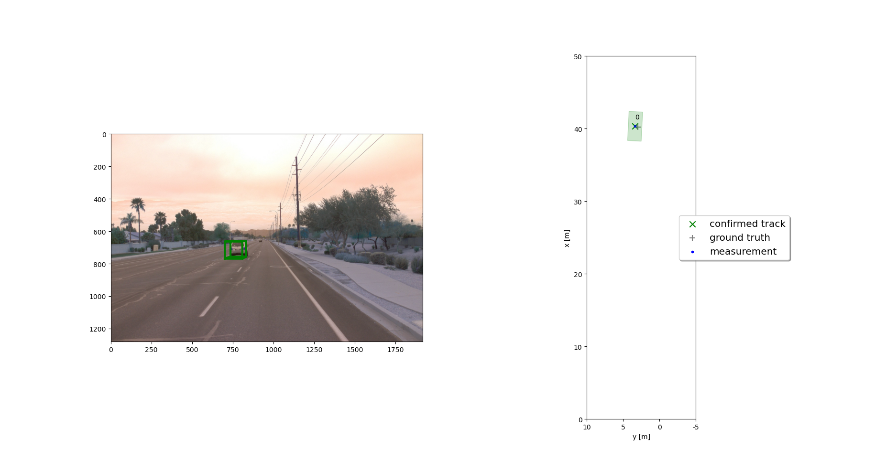
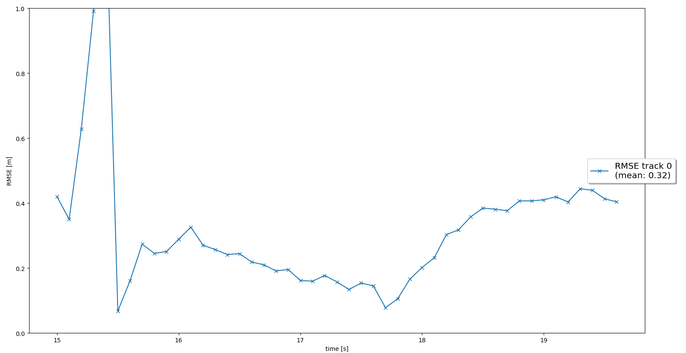
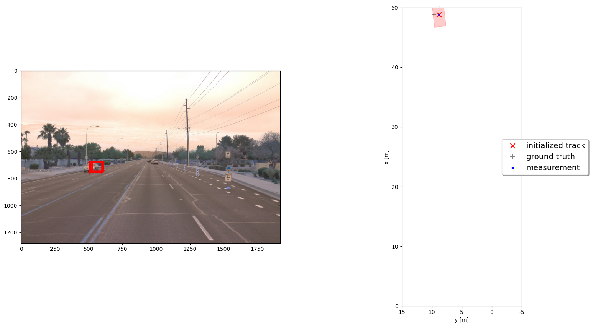
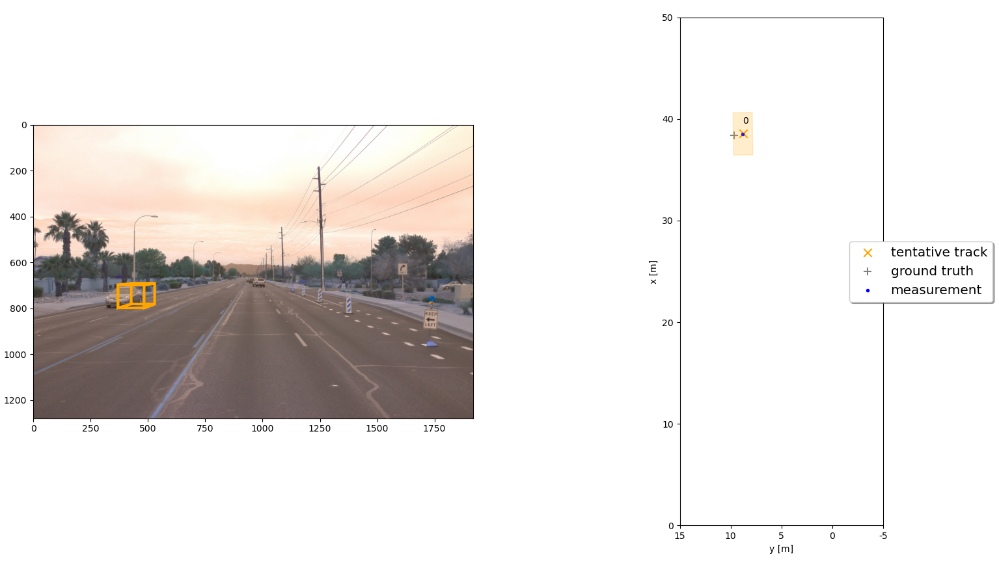
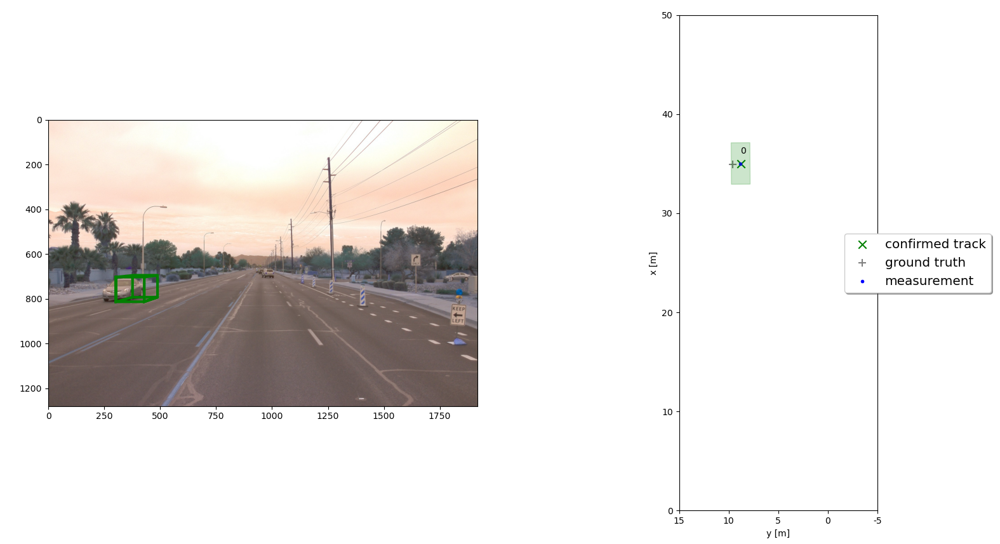
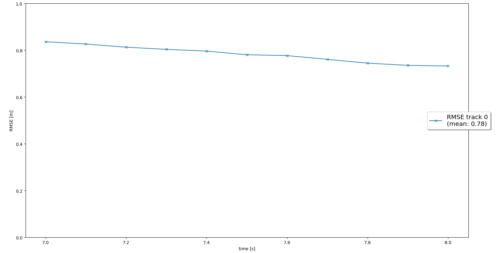
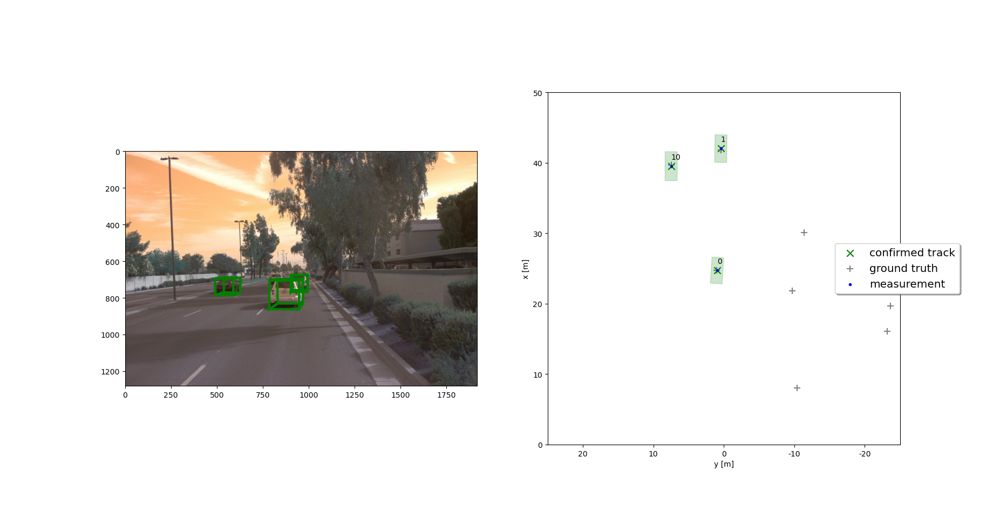
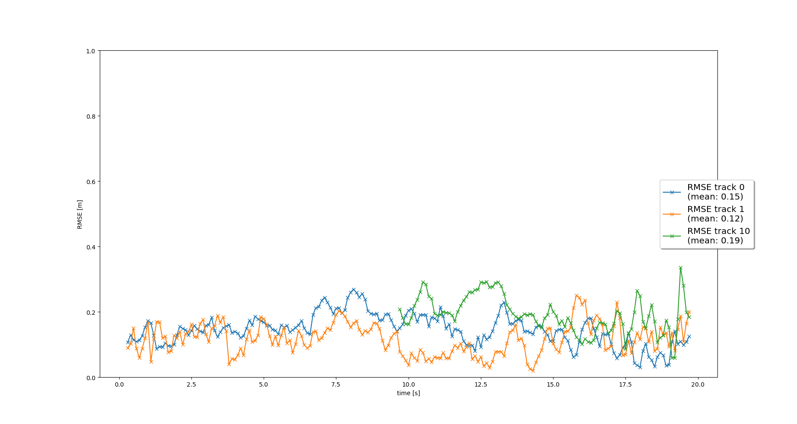
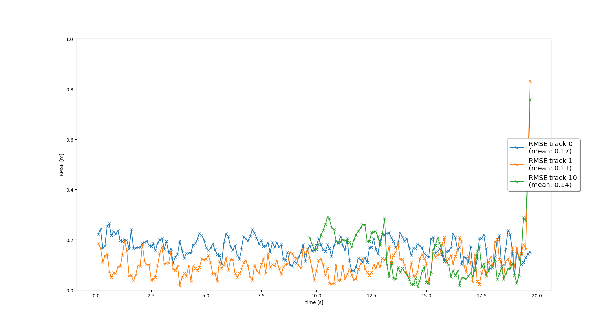

#  Sensor Fusion and Tracking - Object tracking

## Step 1 : Tracking - Track objects over time with a Kalman Filter

## Step 2 : Track Management - Initialize, update and delete tracks

## Step 3 : Data Association - Associate measurements to tracks with nearest neighbor association

## Step 4 : Sensor Fusion - Fuse measurements from lidar and camera

## Answer Questions
### 1. Write a short recap of the four tracking steps and what you implemented there (filter, track management, association, camera fusion). Which results did you achieve? Which part of the project was most difficult for you to complete, and why?
4 implemented tracking steps and results:
1. Implement an EKF to track a single real-world target with lidar measurement. The mean RMSE is 0.32
2. Implement the track management to initialize and delete tracks, set a track state and a track score. There is one single track without track losses in between. The mean RMSE is 0.78, it is quite high because the lidar detections contain a y-offset and the Kalman filter cannot compensate it.
3. Implement a single nearest neighbor data association to associate measurements to tracks. The mean RMSE is 0.15 for track 0, 0.12 for track 1 and 0.19 for track 10.
4. Implement the nonlinear camera measurement model and fuse measurements from lidar and camera. The mean RMSE is 0.17 for track 0, 0.11 for track 1 and 0.14 for track 10.

For me, step 3 was the most difficult one since it contains many matrix operations such as get minimum indices, delete column/row, rtc.

### 2. Do you see any benefits in camera-lidar fusion compared to lidar-only tracking (in theory and in your concrete results)? 
Camera-lidar fusion has better result for tracking since it provides more measurements for detected objects which help to decrease the covariance when added to the Kalman filter. With camera-lidar fusion, the mean RMSE for track 1 reduced from 0.12 to 0.11 and from 0.19 to 0.14 for track 10.

### 3. Which challenges will a sensor fusion system face in real-life scenarios? Did you see any of these challenges in the project?
Sensor fusion issues in real-life scenarios:
- Sensor performance could be heavily affected by working environments. For example, even with camera-lidar fusion, we still have issues when detecting objects in bad weather such as heavy fog.
- Sensor position may be changed from its original position which affects sensor to vehicle coordinates translation.
- Sensor outputs may be totally different in some cases which makes fusion algorithm confused.  

I dit not see these issues in the project, we worked on an ideal fusion situation: weather is clear, sensor positions are fixed, sensor parameters are correctly provided, etc.

### 4. Can you think of ways to improve your tracking results in the future?
We could improve tracking results by:
- Fine-tune parameters such as process noise Q, measurement noise R, initial setting for estimation error covariance P.
- Increase frame rate to reduce uncertainty in estimation.
- Use more complicated models for vehicle motion such as check turn signal to predict the vehicle next movement.
