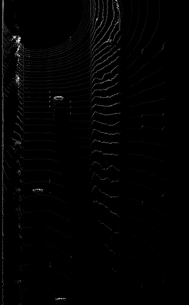
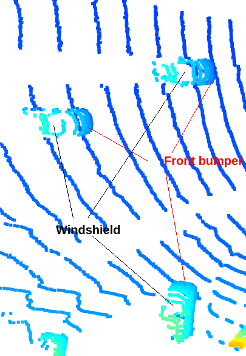

#  Sensor Fusion and Tracking - Object Detection

## Section 1 : Compute Lidar Point-Cloud from Range Image
### Visualize range image channels (ID_S1_EX1)

### Visualize lidar point-cloud (ID_S1_EX2)

## Section 2 : Create Birds-Eye View from Lidar PCL
### Convert sensor coordinates to BEV-map coordinates (ID_S2_EX1)

### Compute intensity layer of the BEV map (ID_S2_EX2)

### Compute height layer of the BEV map (ID_S2_EX3)

## Section 3 : Model-based Object Detection in BEV Image

## Section 4 : Performance Evaluation for Object Detection
### DarkNet
Precision = 0.9292604501607717, Recall = 0.9444444444444444

### FPN-ResNet
Precision = 1.0, Recall = 0.8562091503267973

## Answer Questions
### Find and display 10 examples of vehicles with varying degrees of visibility
- 3 vehicles driving in opposite direction with high visibility

- 3 vehicles driving in opposite direction with low visibility

- 3 vehicles driving in same direction with high visibility (1 car with trailer in front of the ego vehicle and 2 cars behind the ego vehicle) 

- 4 vehicles on the right side with high visibility

- 4 vehicles on the left side with very low visibility

### Identify stable vehicle features in the point-cloud
Bumpers (both front and rear) and windshields are clearly visible in most cases. This could be because of their large reflective surface and their materials.

